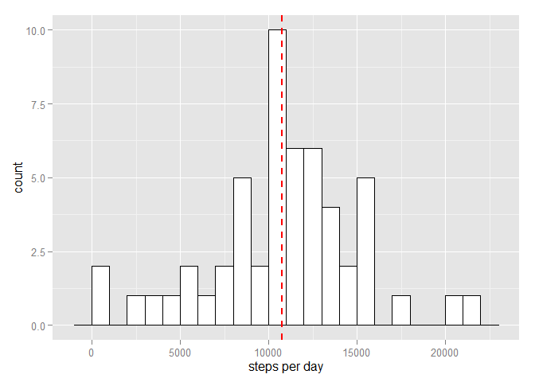
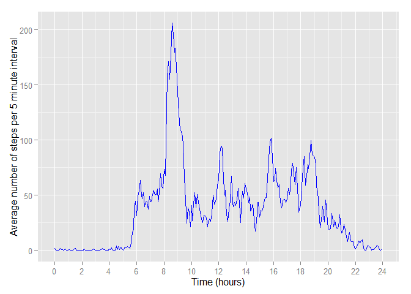
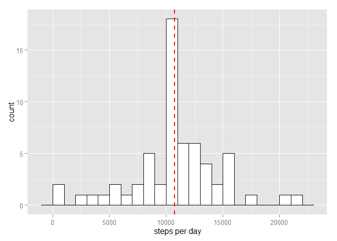

# Reproducible Research: Peer Assessment 1


## Loading and preprocessing the data

Set the working directory

```r
setwd("C:/Users/Mike/Rspace/JHU_RR/RepData_PeerAssessment1")
```

Unzip the data file if this has not yet been done

```r
if(!file.exists("activity.csv")){
        unzip("activity.zip")
        }
```
Load the data into a data frame df. Convert dates to Date format and include a column df.tdec that contains the decimal time of each interval.

```r
library(lubridate)
df<-read.csv("activity.csv",stringsAsFactors=FALSE)
df$date<-as.Date(df$date)
time<-as.character(formatC(df$interval, width = 4, format = "d", flag = "0"))
h<-substr(time,start=1,stop=2)
m<-substr(time,start=3,stop=4)
time<-paste(h,":",m,sep="")

t.lub<-hm(time)
tdec <- hour(t.lub) + minute(t.lub)/60


df<-data.frame(df,tdec,stringsAsFactors=FALSE)
#df$time<-as.POSIXct(df$time,format="%H%M")
```
### First inspection of the data
Structure

```r
str(df)
```

```
## 'data.frame':	17568 obs. of  4 variables:
##  $ steps   : int  NA NA NA NA NA NA NA NA NA NA ...
##  $ date    : Date, format: "2012-10-01" "2012-10-01" ...
##  $ interval: int  0 5 10 15 20 25 30 35 40 45 ...
##  $ tdec    : num  0 0.0833 0.1667 0.25 0.3333 ...
```
and Summary:


```r
summary(df, na.rm=TRUE)
```

```
##      steps             date               interval           tdec       
##  Min.   :  0.00   Min.   :2012-10-01   Min.   :   0.0   Min.   : 0.000  
##  1st Qu.:  0.00   1st Qu.:2012-10-16   1st Qu.: 588.8   1st Qu.: 5.979  
##  Median :  0.00   Median :2012-10-31   Median :1177.5   Median :11.958  
##  Mean   : 37.38   Mean   :2012-10-31   Mean   :1177.5   Mean   :11.958  
##  3rd Qu.: 12.00   3rd Qu.:2012-11-15   3rd Qu.:1766.2   3rd Qu.:17.938  
##  Max.   :806.00   Max.   :2012-11-30   Max.   :2355.0   Max.   :23.917  
##  NA's   :2304
```


## What is mean total number of steps taken per day?
First find the number of steps taken each day

```r
dailysum<-aggregate(steps~date,df,sum,na.rm=TRUE)
```
Plot a histogram of the counts for total steps per day, showing the mean value as a red dashed line.

```r
library(ggplot2)
	

a<-ggplot(dailysum, aes(x=steps)) +
    geom_histogram(binwidth=1000, colour="black", fill="white") +
    geom_vline(aes(xintercept=mean(steps, na.rm=T)),   # Ignore NA values for mean
               color="red", linetype="dashed", size=1)
a<-a+xlab("steps per day")
a
```

 
  
Find the mean number of steps taken per day

```r
meansteps<-mean(dailysum$steps)
```
The mean number is 10766


and the median number of steps per day

```r
mediansteps<-median(dailysum$steps)
```
The median number is 10765

## What is the average daily activity pattern?

Construct the data frame "dap" which contains, for each interval of the day the average number of steps in that interval, across all days in the data set. The decimal time of eacvh interval is included in another column.

```r
dap<-sapply(split(df$steps, df$interval), mean,na.rm=TRUE)
str(dap)
```

```
##  Named num [1:288] 1.717 0.3396 0.1321 0.1509 0.0755 ...
##  - attr(*, "names")= chr [1:288] "0" "5" "10" "15" ...
```

```r
ddf<-as.data.frame(dap)
ints<-unique(df$tdec)
dap<-cbind(ints,ddf)
colnames(dap)<-c("time","steps")
str(dap)
```

```
## 'data.frame':	288 obs. of  2 variables:
##  $ time : num  0 0.0833 0.1667 0.25 0.3333 ...
##  $ steps: num  1.717 0.3396 0.1321 0.1509 0.0755 ...
```

```r
head(dap)
```

```
##          time     steps
## 0  0.00000000 1.7169811
## 5  0.08333333 0.3396226
## 10 0.16666667 0.1320755
## 15 0.25000000 0.1509434
## 20 0.33333333 0.0754717
## 25 0.41666667 2.0943396
```
Plot against interval number the average across all days in the data set of the number of steps taken in each interval. 


```r
b<-ggplot(dap, aes(x=ints,y=steps)) +
    geom_line(colour="blue")
b<-b+xlab("Time (hours)")+ylab("Average number of steps per 5 minute interval")
b<-b+scale_x_continuous(limits=c(0,24),breaks = seq(0, 24, 2))
b
```

 

Which interval has the maximum number of steps?


```r
mint<-dap$time[which.max(dap$steps)]
mint<-paste(floor(mint),":",60*(mint-floor(mint)),sep="")
```
It is the interval which starts at 8:35

## Imputing missing values

First we find how many missing values there are.


```r
nmissing<-sum(is.na(df$steps))
```
There are 2304 missing values in the data set.

Our strategy for imputing missing values will be to set the number of steps in each 5 minute interval where the value is missing to be equal to the average for that interval of non-missing values over the whole data set.

We now create a new data set that is equal to the original data set but with the missing values filled in.


```r
library(dplyr)
df<-group_by(df,interval)
df3<-summarise(df,avg=mean(steps,na.rm=TRUE))
df<-ungroup(df)

nr3<-nrow(df3)
avgcol<-c(rep(0,ncol(df)))
indcol<-c(rep(0,ncol(df)))
df.imp<-data.frame(df,avgcol,indcol)

df.imp$indcol[is.na(df.imp$steps)]<-1
df.imp$avgcol<-df.imp$avgcol+df3$avg

df.imp$steps[is.na(df.imp$steps)]<-0
df.imp$steps<-df.imp$avgcol*df.imp$indcol+df.imp$steps
df.imp<-select(df.imp,-(avgcol:indcol))
```

```r
dailysum.imp<-aggregate(steps~date,df.imp,sum,na.rm=TRUE)
```

Plot a histogram of the counts for total steps per day, NA values having been imputed with avarege value for that time period. The mean value is shown as a red dashed line.

```r
library(ggplot2)       
c<-ggplot(dailysum.imp, aes(x=steps)) +
    geom_histogram(binwidth=1000, colour="black", fill="white") +
    geom_vline(aes(xintercept=mean(steps, na.rm=T)),   # Ignore NA values for mean
               color="red", linetype="dashed", size=1)
c<-c+xlab("steps per day")
c
```

 

Find the mean number of steps taken per day

```r
meansteps.imp<-mean(dailysum.imp$steps)
```
The mean number after imputation is 10766

and the median number of steps per day after imputation:

```r
mediansteps.imp<-median(dailysum.imp$steps)
```
The median number of steps per day, after imputation  is 10766

It makes little difference whether imputed values are included or not.

## Are there differences in activity patterns between weekdays and weekends?


```r
df.imp$day<-weekdays(df.imp$date)
daytype<-c(rep("weekday",nrow(df.imp)))

for(i in 1:nrow(df.imp)){
        if(df.imp$day[i]=="Saturday" | df.imp$day[i]=="Sunday"){
                daytype[i]<-"weekend"
        }
}

df.imp<-data.frame(df.imp,daytype)

summary(df.imp)
```

```
##      steps             date               interval           tdec       
##  Min.   :  0.00   Min.   :2012-10-01   Min.   :   0.0   Min.   : 0.000  
##  1st Qu.:  0.00   1st Qu.:2012-10-16   1st Qu.: 588.8   1st Qu.: 5.979  
##  Median :  0.00   Median :2012-10-31   Median :1177.5   Median :11.958  
##  Mean   : 37.38   Mean   :2012-10-31   Mean   :1177.5   Mean   :11.958  
##  3rd Qu.: 27.00   3rd Qu.:2012-11-15   3rd Qu.:1766.2   3rd Qu.:17.938  
##  Max.   :806.00   Max.   :2012-11-30   Max.   :2355.0   Max.   :23.917  
##      day               daytype     
##  Length:17568       weekday:12960  
##  Class :character   weekend: 4608  
##  Mode  :character                  
##                                    
##                                    
## 
```

```r
head(df.imp)
```

```
##       steps       date interval       tdec    day daytype
## 1 1.7169811 2012-10-01        0 0.00000000 Monday weekday
## 2 0.3396226 2012-10-01        5 0.08333333 Monday weekday
## 3 0.1320755 2012-10-01       10 0.16666667 Monday weekday
## 4 0.1509434 2012-10-01       15 0.25000000 Monday weekday
## 5 0.0754717 2012-10-01       20 0.33333333 Monday weekday
## 6 2.0943396 2012-10-01       25 0.41666667 Monday weekday
```

```r
str(df.imp)
```

```
## 'data.frame':	17568 obs. of  6 variables:
##  $ steps   : num  1.717 0.3396 0.1321 0.1509 0.0755 ...
##  $ date    : Date, format: "2012-10-01" "2012-10-01" ...
##  $ interval: int  0 5 10 15 20 25 30 35 40 45 ...
##  $ tdec    : num  0 0.0833 0.1667 0.25 0.3333 ...
##  $ day     : chr  "Monday" "Monday" "Monday" "Monday" ...
##  $ daytype : Factor w/ 2 levels "weekday","weekend": 1 1 1 1 1 1 1 1 1 1 ...
```
Ahem

```r
df.group<-df.imp %>% group_by(daytype) %>% summarise(avg=mean(steps))
str(df.group)
```

```
## Classes 'tbl_df', 'tbl' and 'data.frame':	2 obs. of  2 variables:
##  $ daytype: Factor w/ 2 levels "weekday","weekend": 1 2
##  $ avg    : num  35.6 42.4
##  - attr(*, "drop")= logi TRUE
```

```r
xxx<-df.imp %>% group_by(interval,daytype) %>% summarise(mean(steps))
head(xxx)
```

```
## Source: local data frame [6 x 3]
## Groups: interval
## 
##   interval daytype mean(steps)
## 1        0 weekday  2.25115304
## 2        0 weekend  0.21462264
## 3        5 weekday  0.44528302
## 4        5 weekend  0.04245283
## 5       10 weekday  0.17316562
## 6       10 weekend  0.01650943
```

```r
str(xxx)
```

```
## Classes 'grouped_df', 'tbl_df', 'tbl' and 'data.frame':	576 obs. of  3 variables:
##  $ interval   : int  0 0 5 5 10 10 15 15 20 20 ...
##  $ daytype    : Factor w/ 2 levels "weekday","weekend": 1 2 1 2 1 2 1 2 1 2 ...
##  $ mean(steps): num  2.2512 0.2146 0.4453 0.0425 0.1732 ...
##  - attr(*, "vars")=List of 1
##   ..$ : symbol interval
##  - attr(*, "drop")= logi TRUE
```


```r
dap.imp<-df.imp %>% group_by(interval,daytype) %>% summarise(mean(steps))
str(dap.imp)
```

```
## Classes 'grouped_df', 'tbl_df', 'tbl' and 'data.frame':	576 obs. of  3 variables:
##  $ interval   : int  0 0 5 5 10 10 15 15 20 20 ...
##  $ daytype    : Factor w/ 2 levels "weekday","weekend": 1 2 1 2 1 2 1 2 1 2 ...
##  $ mean(steps): num  2.2512 0.2146 0.4453 0.0425 0.1732 ...
##  - attr(*, "vars")=List of 1
##   ..$ : symbol interval
##  - attr(*, "drop")= logi TRUE
```

```r
head(dap.imp)
```

```
## Source: local data frame [6 x 3]
## Groups: interval
## 
##   interval daytype mean(steps)
## 1        0 weekday  2.25115304
## 2        0 weekend  0.21462264
## 3        5 weekday  0.44528302
## 4        5 weekend  0.04245283
## 5       10 weekday  0.17316562
## 6       10 weekend  0.01650943
```

```r
ddf.imp<-as.data.frame(dap.imp)
ints<-unique(df.imp$tdec)
dap.imp<-cbind(ints,ddf.imp)
colnames(dap.imp)<-c("time","steps","daytype","avg")
dap.imp$ints<-dap.imp$steps*1
str(dap.imp)
```

```
## 'data.frame':	576 obs. of  5 variables:
##  $ time   : num  0 0.0833 0.1667 0.25 0.3333 ...
##  $ steps  : int  0 0 5 5 10 10 15 15 20 20 ...
##  $ daytype: Factor w/ 2 levels "weekday","weekend": 1 2 1 2 1 2 1 2 1 2 ...
##  $ avg    : num  2.2512 0.2146 0.4453 0.0425 0.1732 ...
##  $ ints   : num  0 0 5 5 10 10 15 15 20 20 ...
```

```r
head(dap.imp)
```

```
##         time steps daytype        avg ints
## 1 0.00000000     0 weekday 2.25115304    0
## 2 0.08333333     0 weekend 0.21462264    0
## 3 0.16666667     5 weekday 0.44528302    5
## 4 0.25000000     5 weekend 0.04245283    5
## 5 0.33333333    10 weekday 0.17316562   10
## 6 0.41666667    10 weekend 0.01650943   10
```

```r
plot(dap.imp$time,dap.imp$avg,type="l")
```

 as factor-1.png) 

```r
c<-ggplot(dap.imp, aes(x=time,y=avg))
c<-c+geom_line(colour="blue")
c<-c+facet_wrap(~daytype)

c<-c+scale_x_continuous(limits=c(0,24),breaks = seq(0, 24, 2))
c<-c+xlab("Time (hours)")+ylab("Average number of steps per 5 minute interval")
c
```

 as factor-2.png) 


